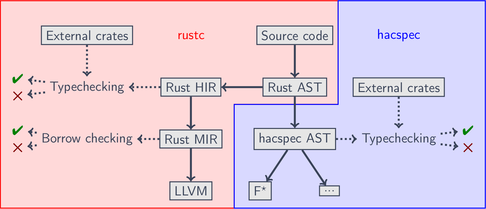

# Working on the compiler

## High-level architecture



The Rustspec compiler intervenes after the regular Rust typechecking,
by translating the Rust AST into a stricter hacspec AST,
yielding error messages if you're not in the subset.

The hacspec AST then undergoes a typechecking phase that replicates the
formal typechecking judgment of hacspec, before being compiled
to the proof backends like F* or Coq.

## Code organization

The source code for the compiler is located in the `language/` folder.
`main.rs` is the file containing the driver for the different compiler
passes.

### Hacspec AST

The main file of the compiler is `rustspec.rs` and it contains the AST
structure.

Types are usually enclosed into `Spanned<...>` blocks that attach a location
information to an AST node, thereby providing a way to display beautiful error
message.

Several nodes also contain a `Fillable<...>` node standing for information
that is filled by the typechecking phase but that can be left to `None` when
building the AST.

### Translation from Rust AST

This phase is contained in `ast_to_rustspec.rs`. The trickyness of this
translation is that it needs to be aware of certain special names contained
in the structure `SpecialNames`. Indeed, while the Rust AST treats the application
enum constructors like function applications, the hacspec AST considers them as
proper injection so we need to distinguish them in the Rust AST. For that, we
need to know all declared enums at this point of the program.

Enums and other `SpecialNames` are also defined in the `ExternalData` that
contains the signatures and types imported in crates used by the hacspec
program being compiled.

### Name resolution

When the translation from Rust AST is finished, the identifiers for all
variables inside function bodies are of the following type:

```rust, noplaypen
pub enum Ident {
    Unresolved(String),
    Local(LocalIdent),
    TopLevel(TopLevelIdent),
}
```

More precisely, they are still in the `Ident::Unresolved` case. The compiler
pass in `name_resolution.rs` resolves the identifiers by linking them to local or global identifiers,
each one having a unique ID. hacspec does not feature De Bruijn variable
handling, instead relying on unique fresh IDs for differentiating local
and global variables from each other.

### External data

A hacspec file can never (in principal) be considered alone, as it usually imports
at least several other crates like the hacspec standard library. These external
crates must pre-populate the typechecking context with the types and function
signatures that they define.

It's the job of `hir_to_rustspec.rs` to retrieve this data. The critical
piece of code in this file is [the following](https://github.com/hacspec/hacspec/blob/cc609254b0aa978646f494291b9c91a92fe107ee/language/src/hir_to_rustspec.rs#L733-L737):

```rust, noplaypen
let num_def_ids = crate_store.num_def_ids_untracked(*krate_num);
let def_ids = (0..num_def_ids).into_iter().map(|id| DefId {
    krate: *krate_num,
    index: DefIndex::from_usize(id),
});
```

First, we retrieve the number of exported symbols by an external crate using
`num_def_ids_untracked`, a function that is [specifically labeled](https://github.com/rust-lang/rust/pull/85889)
as critical to the hacspec compiler in the Rust compiler codebase. Then,
we manufacture definition IDs for all these exported symbols, relying on the
invariant that they are numbered from 0 to the number of exported symbols
in Rust's compiled crate metadata format.

Then, we use those definition IDs (`DefId`) to query the Rust compiler
via the central [`TyCtxt`](https://doc.rust-lang.org/nightly/nightly-rustc/rustc_middle/ty/struct.TyCtxt.html)
data structure. If the `DefId` corresponds to a type definition, we examine the
type definition structurally and check whether it corresponds to a hacspec-compatible
type definition. Notably, the type definitions generated by macros like `array!`
or `nat_mod!` are only seen here in their expanded version, so we have to retro-engineer
which expanded version corresponds to which macro expansion. This is a vulnerability
of the compiler since it's possible to break the abstraction of the language
by smuggling in a type not defined via a hacspec macro this way. That's why hacspec
developers should be very careful about which dependencies they import in order
to have a 100% safety guarantee.

For `DefId`s corresponding to functions, the signature of the function is analysed
and if it fits the subset of types expected by hacspec, the function is imported
along with its type in a pre-populated typechecking context.

Note that it is not possible any more at this point to retrieve the `#[in_hacspec]`,
`#[unsafe_hacspec]`, etc. attributes that would tag the external definitions,
since these attributes get erased by the Rust compiler before reaching the
compiled crates metadata.


### Typechecking

The typechecking is done in `typechecker.rs` and follows a very regular structure,
making heavy use of immutable data structures to not mess up the various
context manipulations.

Note that we need to perform a full typechecking complete with method resolution
because the proof backends need very fine-grained typechecking information
to generate correct code.

Be careful: types often need to be de-aliased with `dealias_type` before
being matched on structurally. Forgetting to dealias will lead to bugs with
type aliases.

### Proof backends

The different proof backends (`rustspec_to_fstar.rs`, etc) all enjoy a similar
structure that ought to be refactored to showcase their commonality. The backends
don't use an intermediate AST to generate the code in the proof assistant but
rather directly print code as string using the [`pretty`](https://crates.io/crates/pretty)
pretty-printing library. If you want to start a new proof backend, the easiest
solution is probably to copy an existing proof backend and tweak it until
you get the right result.

The code generation has to be fine-tuned to interface with a replica of the
hacspec standard library in the host proof assistant, whose correspondence with
the original hacspec library in Rust is part of the trusted code base. More specially,
clever solutions to encode sequences and array, as well as all the different types
of public and secret machine integers, and the interaction between the two
(seeing a double as a string of bytes) have to be implemented through proof
assistant libraries.

## Unit tests

The compiler has various unit tests that are controlled trough the `language/tests`
files. Please enrich the unit tests bases in `language-tests`,
`negative-language-tests` and `test-crate` as you implement new features for
the compiler. The compiler can also be tested against all the hacspec cryptographic
specifications by running `examples/typecheck_examples.sh` from the root of
the repository.
