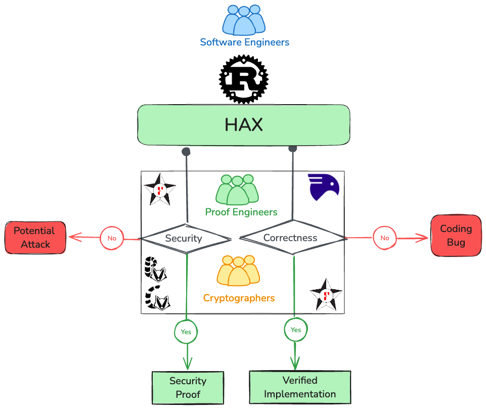
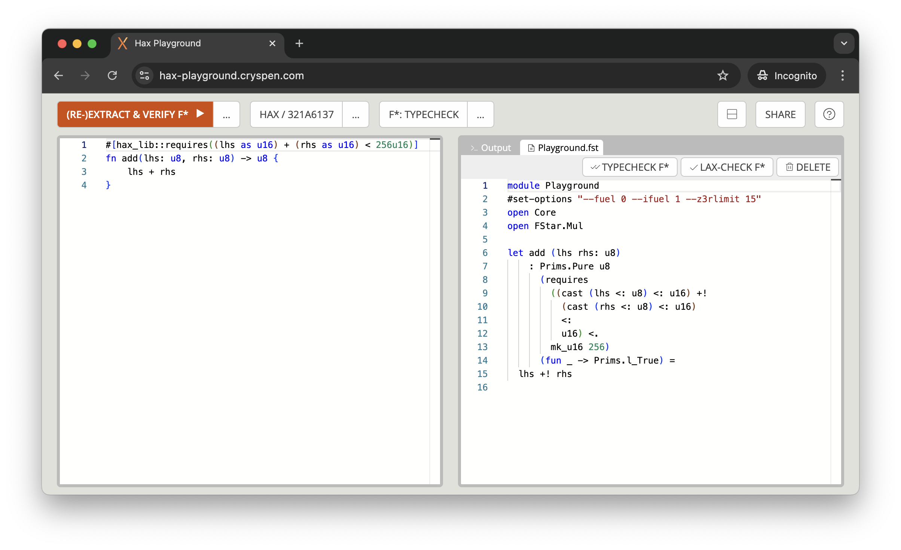

# hax

hax is a tool for high assurance translations of a large subset of
Rust into formal languages such as [F\*](https://www.fstar-lang.org/) or [Rocq](https://rocq-prover.org/).

Head over to the [Manual](./manual/index.md) or the [playground](https://hax-playground.cryspen.com)
to get started!

## Playground
Try out hax in the browser on the [playground](https://hax-playground.cryspen.com).

## Community

Join the hax community on our [Zulip chat](https://hacspec.zulipchat.com).
